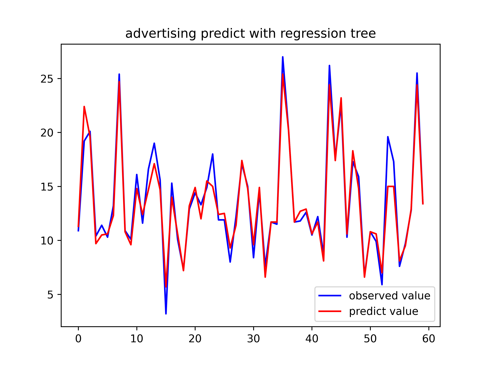
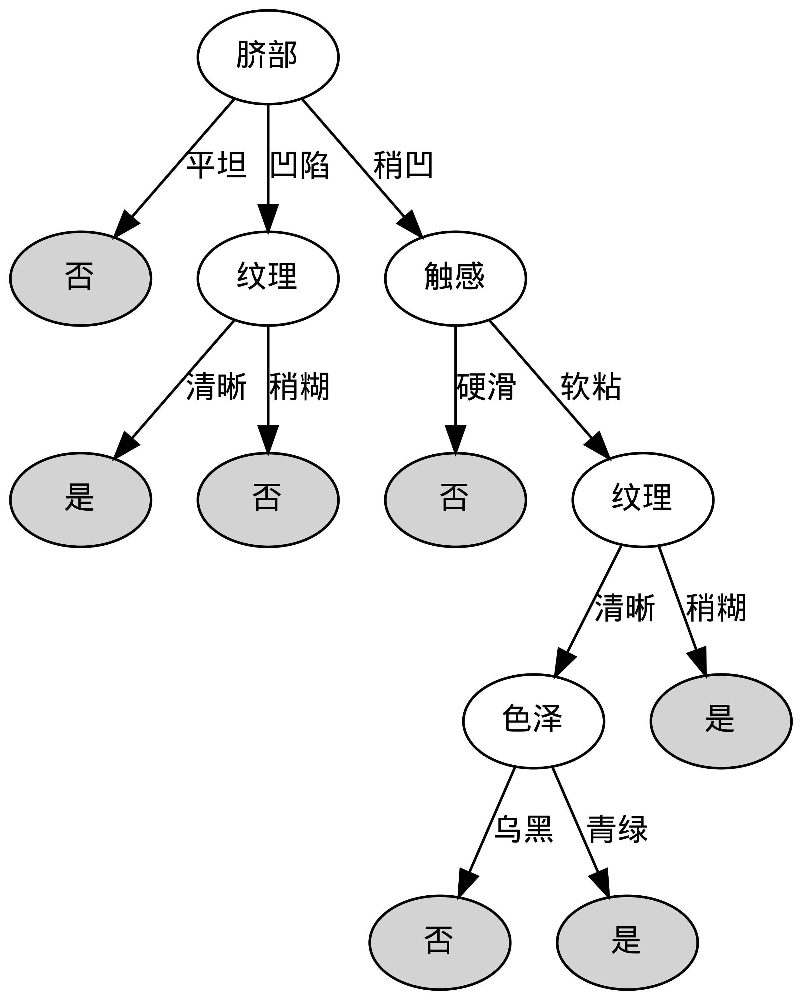
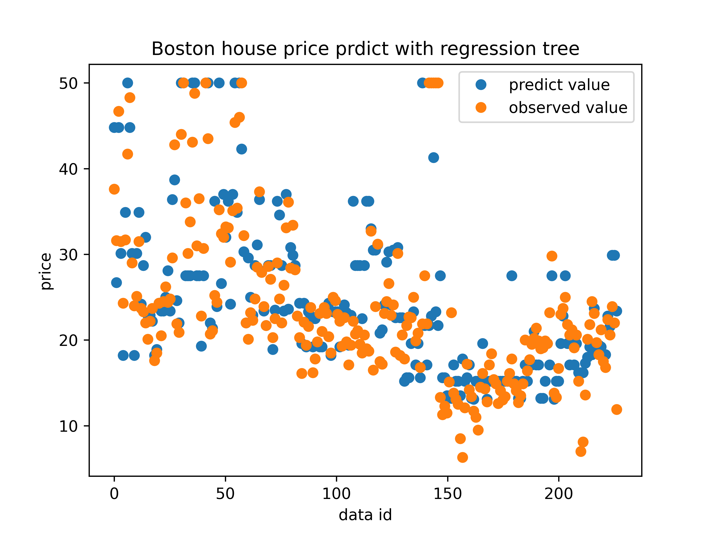
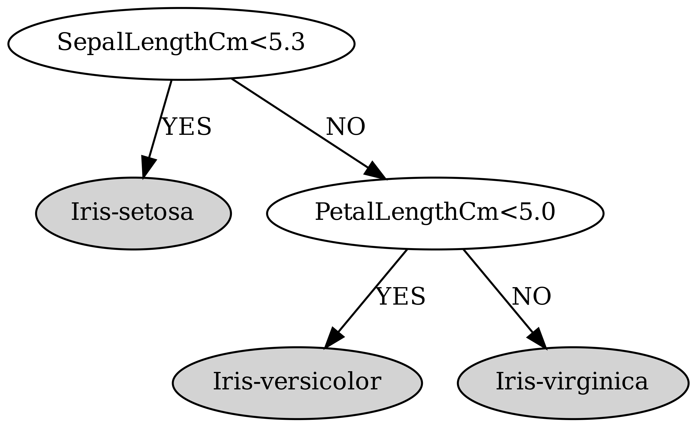

## 说明

1. 目录结构如下所示

```python
.
├── data
│   ├── Iris.csv
│   ├── advertising.csv
│   ├── boston_housing_data.csv
│   ├── titanic
│   │   ├── gender_submission.csv
│   │   ├── test.csv
│   │   └── train.csv
│   ├── titanic_pred.csv
│   ├── watermelon20.csv
│   ├── watermelon20_2.csv
│   ├── watermelon_3a.csv
│   ├── zoo.csv
│   └── 数据集描述.csv
├── img
│   ├── (watermelon) logistic regression on test set.png
│   ├── (watermelon) logistic regression on training set.png
│   ├── Boston_house_price_predict.png
│   ├── ad.svg
│   ├── ad_result.png
│   ├── irisDevisionTree.png
│   ├── irisDevisionTreeSimple.png
│   ├── ticnic.png
│   ├── ticnic.svg
│   ├── watermelonDevisionTreeTrain.png
│   └── zooDevisionTree.png
├── model
│   ├── decision_tree.py
│   ├── decision_tree_c.py
│   └── reg_tree.py
├── data_process.py
├── draw_tree.py
├── predict_ad.py
├── predict_boston.py
├── predict_iris.py
├── predict_titanic.py
├── predict_watermelon.py
└── predict_zoo.py

```

2. 对于决策树的可视化绘制，需要调用`graphviz`进行绘制。本实验基于windows，在wsl（linux）环境上实现树的绘制。

   ```shell
   # 使用apt-get 安装 graphviz
   apt-get install graphviz
   # 然后使用pip 安装 graphviz
   pip install graphviz
   ```

3. 运行时需要在exp2文件根目录下（代码写的是相对地址）

## 部分结果展示

- 
- 
- 
- 

